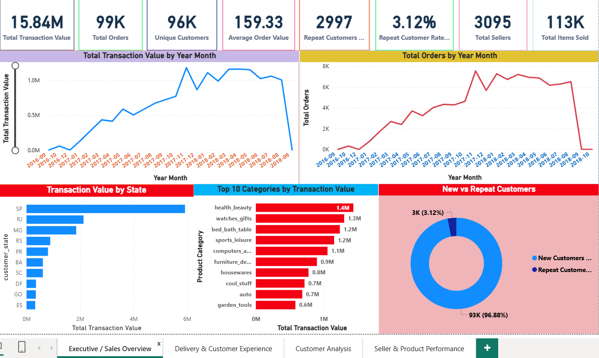
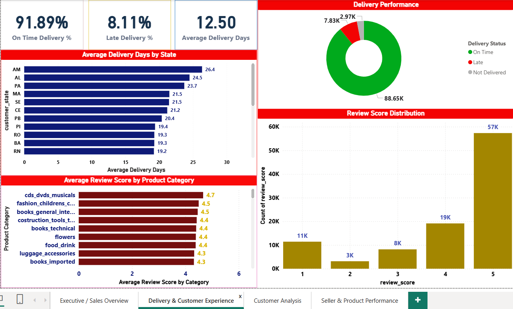
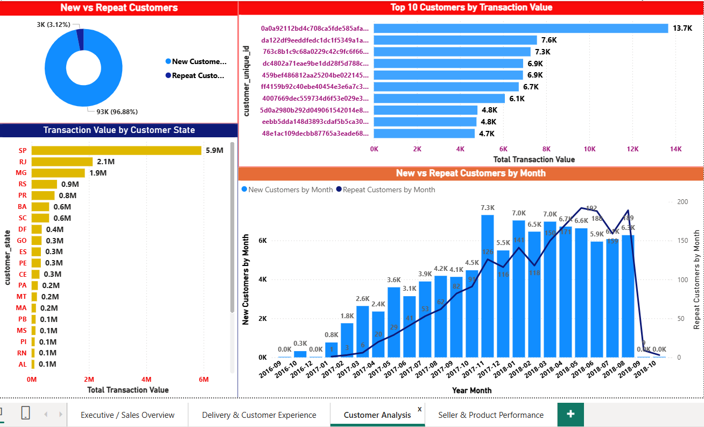
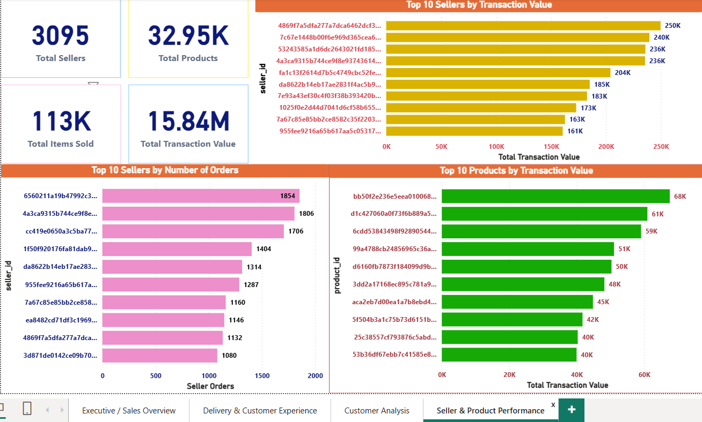

# Brazilian E-Commerce Sales & Customer Analytics

## Project Overview

This project analyzes the Brazilian E-Commerce Public Dataset by Olist using **PostgreSQL and Microsoft Power BI**.

The project focuses on sales performance, customer behavior, product and category performance, delivery operations, payment methods, reviews, sellers, and customer retention.

The analysis combines SQL-based data exploration with an interactive Power BI dashboard to transform raw e-commerce data into meaningful business insights.

---

## Business Questions

This project answers key business questions such as:

- How many orders and unique customers are in the dataset?
- What is the total transaction value and average transaction value?
- Which product categories generate the highest transaction value?
- Which Brazilian states generate the most orders and transaction value?
- What payment methods are most frequently used?
- What is the average customer review score?
- What percentage of orders are delivered on time?
- How long does delivery typically take?
- Which sellers and products perform best?
- How many customers are new versus repeat customers?
- What is the repeat customer rate?
- How does customer acquisition and retention change over time?

---

## Dataset

The project uses the **Brazilian E-Commerce Public Dataset by Olist**.

The dataset contains approximately 100,000 orders from the Brazilian e-commerce marketplace and includes information about:

- Customers
- Orders
- Order Items
- Payments
- Reviews
- Products
- Sellers
- Product Categories
- Customer/Seller Locations
- Product Category Translations

The dataset was imported into PostgreSQL and analyzed using SQL before being connected to Power BI for visualization.

---

## Tools & Technologies

- **PostgreSQL** — Data analysis and SQL querying
- **pgAdmin 4** — PostgreSQL database management
- **Microsoft Power BI** — Data modeling, DAX and visualization
- **Power Query** — Data preparation and transformation
- **DAX** — Measures and customer analytics
- **GitHub** — Project documentation and version control

---

## SQL Analysis

The SQL analysis contains **35 analytical queries** organized into 8 major sections:

### 1. Order & Transaction Analysis

- Total Orders
- Total Transaction Value
- Average Transaction Value
- Unique Customers
- Repeat Customers
- Repeat Customer Rate
- Monthly Order Trend
- Monthly Transaction Value
- Highest Transaction Value Month

### 2. Product & Category Analysis

- Transaction Value by Product Category
- Top 10 Categories by Transaction Value
- Orders by Product Category
- Average Transaction Value by Category

### 3. Geographic Analysis

- Orders by Brazilian State
- Transaction Value by State

### 4. Payment & Customer Experience

- Payment Method Analysis
- Review Score Analysis
- Average Review Score by Product Category
- Order Status Analysis

### 5. Delivery & Operations

- Average Delivery Time
- Late vs On-Time Delivery
- Average Delivery Time by State
- Review Score vs Delivery Performance
- Average Review Score by Payment Type

### 6. Seller Analysis

- Top Sellers by Transaction Value
- Top Sellers by Number of Orders
- Seller Performance by State
- Seller Average Transaction Value

### 7. Product-Level Analysis

- Product Performance Analysis
- Top Products by Sales Volume
- Product Price & Freight Analysis

### 8. Customer Analysis & Retention

- Top Customers by Transaction Value
- New vs Repeat Customer Analysis
- Average Customer Value by State
- Monthly Customer Acquisition & Retention

---

## Power BI Dashboard

The Power BI report contains four analytical pages.

### Page 1 — Executive Sales Overview

Provides a high-level overview of:

- Total Transaction Value
- Total Orders
- Unique Customers
- Average Order Value
- Repeat Customers
- Repeat Customer Rate
- Total Sellers
- Total Items Sold
- Monthly Transaction Value
- Monthly Order Trends
- Transaction Value by State
- Top Categories by Transaction Value
- New vs Repeat Customers

### Page 2 — Delivery & Customer Experience

Analyzes:

- On-Time Delivery %
- Late Delivery %
- Average Delivery Days
- Delivery Performance
- Average Delivery Days by State
- Review Score Distribution
- Average Review Score by Product Category

### Page 3 — Customer Analysis

Focuses on:

- New vs Repeat Customers
- Top Customers by Transaction Value
- Transaction Value by Customer State
- Monthly New Customer Acquisition
- Monthly Repeat Customer Activity

### Page 4 — Seller & Product Performance

Analyzes:

- Total Sellers
- Total Products
- Total Items Sold
- Total Transaction Value
- Top Sellers by Transaction Value
- Top Sellers by Number of Orders
- Top Products by Transaction Value

---

## Key Insights

Some key findings from the analysis include:

- The dataset contains **99,441 orders** and approximately **96,096 unique customers**.
- Total transaction value calculated from product price and freight is approximately **15.84M**.
- Average transaction value per order is approximately **160.58** based on the SQL analysis.
- **São Paulo (SP)** generates the largest share of orders and transaction value among Brazilian states.
- Categories such as **Health & Beauty, Watches & Gifts, Bed Bath & Table, Sports & Leisure, and Computers & Accessories** are among the highest transaction-value categories.
- **Credit card** payments represent the largest payment volume and payment value in the analysis.
- Approximately **91.89%** of delivered orders were classified as on-time, while **8.11%** were classified as late.
- The overall repeat customer rate is approximately **3.12%**.

---

## Dashboard Preview

### Executive Sales Overview



### Delivery & Customer Experience



### Customer Analysis



### Seller & Product Performance



---

## Project Files

```text
Brazilian-Ecommerce-Analytics/
│
├── Olist_Ecommerce_SQL_Analysis.sql
├── README.md
│
├── Executive-Sales-Overview.png
├── Delivery-Customer-Experience.png
├── Customer-Analysis.png
└── Seller-Product-Performance.png
